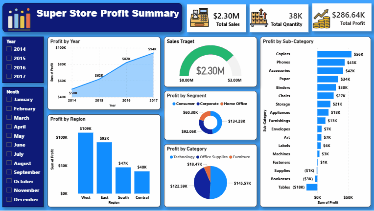

# 📊 Super Store Profit Summary Dashboard



## 🚀 Project Overview
This project is an interactive **Power BI Dashboard** created using the **Super Store dataset**.  
The dashboard provides business insights related to **Sales, Profit, Quantity, Region, Category, and Sub-Category performance**.

The project demonstrates:
- Data Cleaning
- Data Visualization
- Business Intelligence Reporting
- Interactive Dashboard Design

---

## 🛠 Tools & Technologies Used
- Microsoft Excel
- Power BI
- DAX
- Data Visualization

---

## 📂 Project Structure

```bash
├── dashboard
│   └── Super-Store-Profit-Summary.pbix
│
├── data
│   └── Sample - Superstore.xlsx
│
├── images
│   └── dashboard.gif
```

---

## 📈 Dashboard Features

✔ KPI Cards  
✔ Profit Trend Analysis  
✔ Region-wise Profit Analysis  
✔ Category & Segment Analysis  
✔ Sub-Category Performance  
✔ Year & Month Slicers  
✔ Interactive Visualizations  

---

## 🔍 Key Business Insights

- 💰 Total Sales reached **$2.30M**
- 📦 Total Quantity sold: **38K**
- 📈 Total Profit generated: **$286.64K**
- 🌍 West Region generated the highest profit
- 💻 Technology category performed best
- ⚠️ Tables and Bookcases showed negative profit
- 📊 Profit consistently increased from 2014 to 2017

---

## 🎯 Objectives
The main objective of this project was to transform raw sales data into meaningful business insights using Power BI.

---

## 📸 Dashboard Preview


---

## 📁 Dataset
The dataset used in this project is included in the `data` folder.

---

## ⭐ If you like this project
Give this repository a ⭐ and share your feedback!

---

## 📬 Connect With Me
- LinkedIn: Add Your LinkedIn Link Here
- GitHub: Add Your GitHub Profile Link Here
